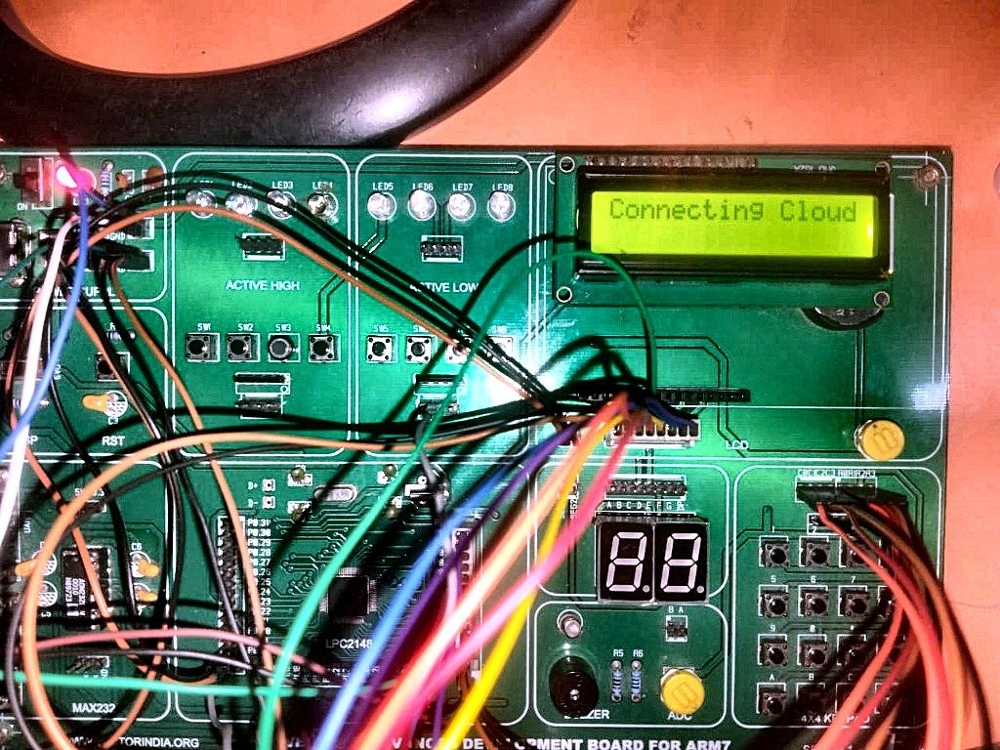
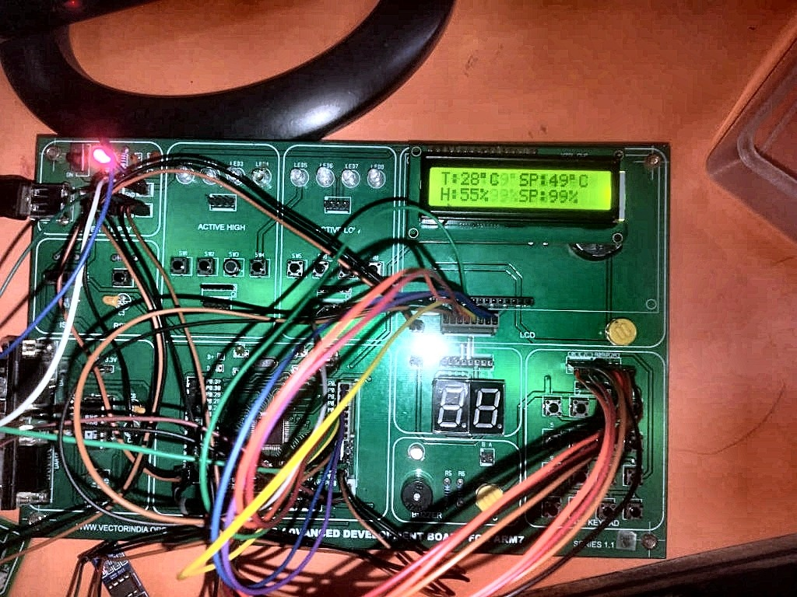
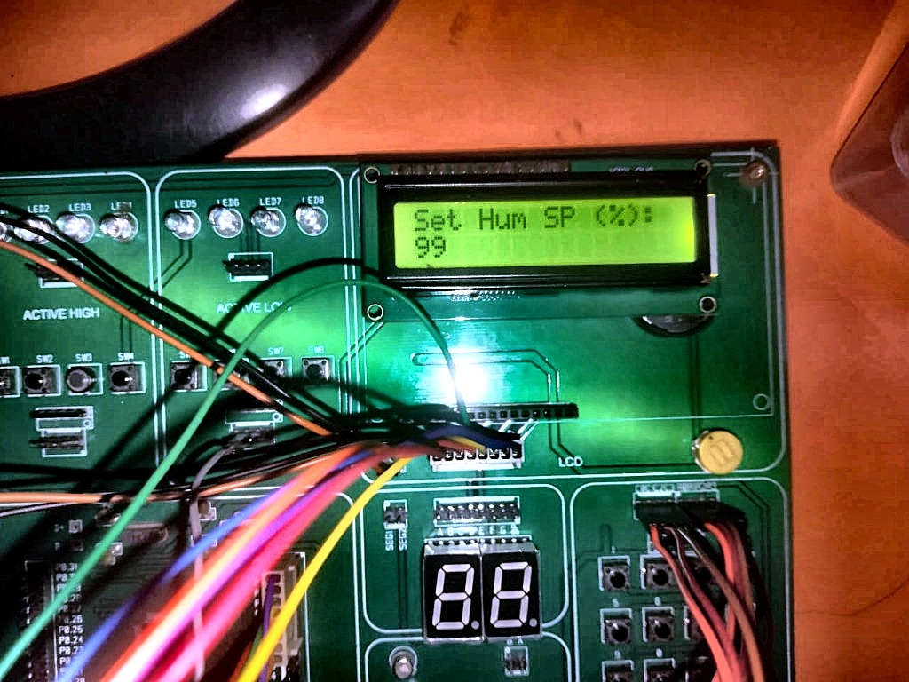
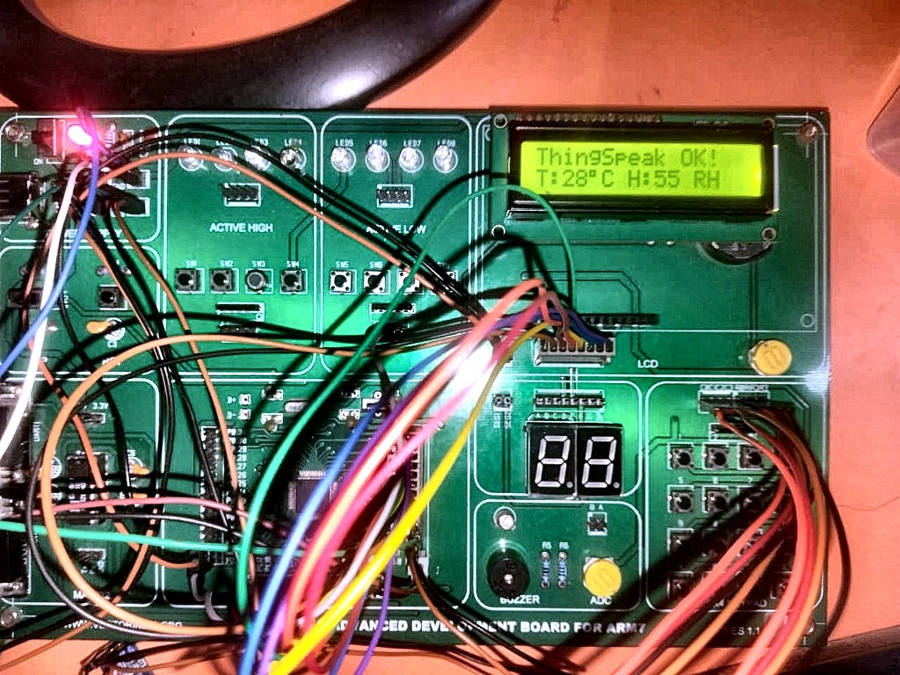

# Edge-to-Cloud Thermo-Humidity Monitoring & Control System

[-00599C?style=for-the-badge&logo=arm)](https://www.nxp.com)
[-red?style=for-the-badge&logo=wi-fi)](https://www.espressif.com)
[](https://thingspeak.com)
[](https://www.keil.com)
[](LICENSE)

An industrial-grade embedded Edge-to-Cloud IoT monitoring and threshold control system developed on the **NXP LPC2148 (ARM7TDMI-S)** microcontroller using **Vector's Advanced ARM7 Development Board**. 

The system continuously acquires real-time ambient temperature and humidity data using a **DHT11 sensor**, displays formatted dual-telemetry on a **16x2 LCD**, enables dynamic threshold configuration for **both Temperature and Humidity setpoints** via a **4x4 Matrix Keypad** triggered by an **External Interrupt (EINT0)**, retains setpoints across power cycles in an **AT24C256 I2C EEPROM**, drives an active **Buzzer alert** when thresholds are breached, and periodically uploads live sensor telemetry to **ThingSpeak Cloud** strictly every **3 minutes using the LPC2148 Hardware RTC**.

---
## 📊 Block Diagram


## 📷 Hardware Showcase & Real-Time Operation





## ✨ Key System Features

- **High-Precision Environmental Sensing**:
  - Samples temperature (`0°C - 50°C`) and relative humidity (`20% - 90% RH`) via single-wire **DHT11 sensor** protocol.
  - Implements **8-bit checksum verification** (`Humidity_Int + Humidity_Dec + Temp_Int + Temp_Dec == Checksum`) with hardware timeout guards to filter invalid noise spikes.
- **Dynamic Dual Threshold Configuration**:
  - Pressing the interrupt push button on `P0.16 (EINT0)` instantly pauses the main loop and triggers an interactive keypad menu.
  - Configures **both Temperature and Humidity Setpoints** dynmically using a **4x4 Matrix Keypad** (`0-9` digit input, `*` for backspace, `#` to confirm).
- **Non-Volatile I2C EEPROM Storage**:
  - Persists configured setpoints in an **AT24C256 I2C EEPROM** (Slave Addr `0x50`):
    - Memory Address `0x0000`: Saved Temperature Setpoint (Default: `35°C`)
    - Memory Address `0x0001`: Saved Humidity Setpoint (Default: `70%`)
  - Ensures automatic recovery of setpoints after power failure.
- **Hardware RTC 3-Minute Cloud Transmission**:
  - Leverages internal **LPC2148 Hardware RTC** peripheral (`CCR`, `PREINT`, `PREFRAC`) to compute precise total elapsed seconds.
  - Posts data to **ThingSpeak Cloud** strictly every **180 RTC seconds (3 minutes)**, preventing API rate limit penalties while optimizing power/bandwidth consumption.
- **Robust ESP-01 Wi-Fi Driver**:
  - Non-blocking UART0 interface operating at `9600 bps`.
  - Performs pre-connect TCP socket cleanups (`AT+CIPCLOSE`) to avoid stale socket deadlocks.
  - Supports multi-pattern response matching (`CONNECT`, `OK`, `ALREADY`, `CONNECTED`, `Linked`, `SEND OK`).
- **Audible Hazard Alerting System**:
  - Triggers active **Buzzer alert** (`P0.7`) with dual beep pulses whenever `Temperature > Temp_SP` OR `Humidity > Hum_SP`.

---

## ⚡ Hardware Architecture & LPC2148 Pin Mapping

### Complete Interfacing Schematic Table

| Peripheral Module | Signal Name | LPC2148 Pin | Pin Function / Mode | Description |
| :--- | :--- | :--- | :--- | :--- |
| **DHT11 Sensor** | DATA | `P0.4` | GPIO Input/Output | Single-wire bidirection data line |
| **16x2 LCD Display** | D0 - D7 | `P0.8 - P0.15` | GPIO Output | 8-bit Parallel Data Bus |
| | RS | `P0.17` | GPIO Output | Register Select (0=CMD, 1=DATA) |
| | EN | `P0.18` | GPIO Output | Enable Strobe Signal |
| | RW | `P0.19` | GPIO Output | Read/Write Select (GND/Write) |
| **Buzzer** | Active High | `P0.7` | GPIO Output | Transistor-driven Piezo Buzzer |
| **Push Button** | EINT0 | `P0.16` | `EINT0` (FUNC2) | External Interrupt 0 (Edge Triggered) |
| **AT24C256 EEPROM** | SCL | `P0.2` | `SCL0` (FUNC1) | Hardware I2C Clock Line |
| | SDA | `P0.3` | `SDA0` (FUNC1) | Hardware I2C Data Line |
| **4x4 Keypad** | Rows 0-3 | `P1.16 - P1.19` | GPIO Output | Keypad Row Drive Lines |
| | Cols 0-3 | `P1.20 - P1.23` | GPIO Input | Keypad Column Sense Lines |
| **ESP-01 Wi-Fi** | TXD -> RX | `P0.0` | `TXD0` (FUNC1) | UART0 Transmit Line |
| | RXD <- TX | `P0.1` | `RXD0` (FUNC1) | UART0 Receive Line |

---

```

---
## 🌐 Cloud Integration Details (ThingSpeak)

The system automatically connects to your mobile hotspot and uploads sensor data to your ThingSpeak channel.

- **Hotspot Credentials**:
  - **SSID**: `Santhi`
  - **Password**: `santhi235`
- **ThingSpeak Channel Details**:
  - **Channel ID**: `3464502`
  - **Write API Key**: `COM3WNTIAZSA0EM2`
  - **Read API Key**: `PKMYJKK5MCI8FZ82`
- **Channel Field Definitions**:
  - `Field 1`: Temperature (°C)
  - `Field 2`: Humidity (% RH)
  - `Field 3`: Alert Status (`0` = Normal, `1` = Alert Triggered)
---


## 📁 Software Component Architecture

major_Edge_cloud/
├── main.c                      # System entry point, main loop & LCD state machine
├── startup_LPC2148.c           # Pure C system bootstrapper
├── rtc.h / rtc.c               # LPC2148 hardware RTC driver (3-min interval timer)
├── esp01.c / esp01.h           # ESP-01 Wi-Fi driver & ThingSpeak HTTP client
├── dht11.c / dht11.h           # DHT11 sensor driver & 8-bit checksum calculation
├── external_interrupts_test.c  # EINT0 interrupt handler & dual set-point menu
├── i2c.c / i2c.h               # LPC2148 hardware I2C driver
├── i2c_eeprom.c / i2c_eeprom.h # AT24C256 EEPROM read/write functions
├── kpm.c / kpm.h               # 4×4 Matrix Keypad scanner (supports 0-9, *, #)
├── lcd.c / lcd.h               # 16×2 Character LCD driver (8-bit mode)
├── uart0.c / uart0.h           # UART0 interrupt-driven serial driver
├── delay.c / delay.h            # Millisecond and microsecond delay utilities
├── global.h                    # Global state variables (setpoint, humidity_setpoint, alert_flag)
├── Edge_cloud.uvproj           # Keil uVision Project file
└── Edge_cloud.hex              # Compiled Intel HEX binary ready for flashing

```

---

### 1. Build the Project in Keil uVision
1. Open [`Edge_cloud.uvproj`](file:///c:/Users/HP/Downloads/india_pro/vector_project/major_Edge_cloud/Edge_cloud.uvproj) in **Keil uVision4** or **Keil uVision5**.
2. Click **Project -> Rebuild all target files** (`F7`).
3. Verify that the compilation completes with `0 Error(s), 0 Warning(s)`.
4. The output binary [`Edge_cloud.hex`](file:///c:/Users/HP/Downloads/india_pro/vector_project/major_Edge_cloud/Edge_cloud.hex) will be generated in the project folder.

### 2. Flash to LPC2148 Development Kit
1. Connect your LPC2148 board to your PC using a USB-to-UART converter (COM port).
2. Open **Flash Magic**.
3. Configure settings:
   - **Device**: LPC2148
   - **COM Port**: Select your COM Port (e.g., COM3)
   - **Baud Rate**: 9600 or 19200
   - **Interface**: None (ISP)
   - **Oscillator Frequency (MHz)**: 12.0
4. Browse and select [`Edge_cloud.hex`](file:///c:/Users/HP/Downloads/india_pro/vector_project/major_Edge_cloud/Edge_cloud.hex).
5. Check **Erase all Flash+Code Rd Protect**.
6. Press the **ISP/Boot button** on your LPC2148 kit and click **Start** in Flash Magic.

---

## 💻 Developer & Profile Info

- **GitHub Profile**: [@santhidaarlanka](https://github.com/santhidaarlanka)
- **Repository**: [santhidaarlanka - Edge-Cloud Thermo Monitoring](https://github.com/santhidaarlanka)
- **Platform**: Embedded C / NXP LPC2148 ARM7 / IoT Edge Computing

---

## 📜 License

This project is open-source and released under the **[MIT License](LICENSE)**. Feel free to use, modify, and distribute it for academic or industrial embedded projects.
